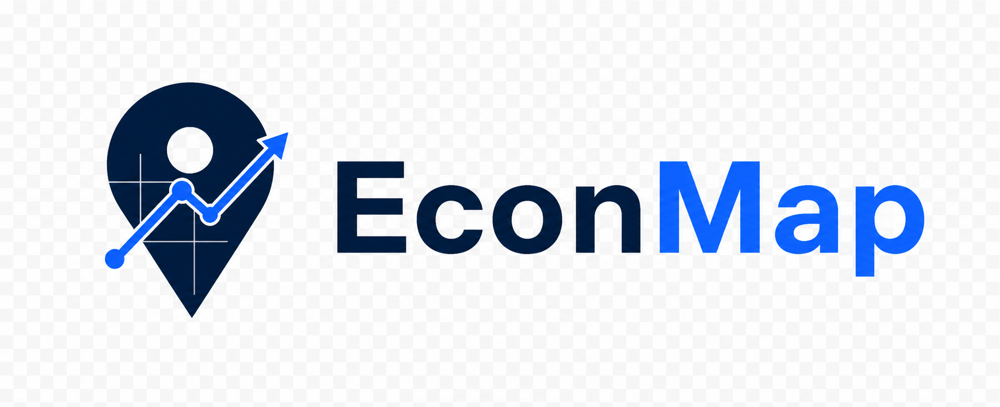

<div align="center">
  
  <!-- CODEX: generate a clean, modern product logo for "EconMap" — a dark-navy, intelligence-grade economic atlas. Motif: a stylized map pin or globe meridian fused with a rising bar/line chart, in deep navy (#0b1f3a) with a single accent (electric blue #1f6feb). Flat, geometric, no gradient noise, transparent background, square-safe at 140px. -->

  # EconMap
  ### Source-backed, city-first OSINT economic atlas

  <!-- badge row -->
  
  
  
  
</div>

> **Executive summary** — EconMap is a dark-by-default, map-first economic intelligence application that turns open economic and geospatial data into a navigable atlas of the world's countries and cities. It serves analysts, investors, and site-selection teams who need decision-grade economic context with every figure tied to its source. EconMap exists because economic intelligence is only as trustworthy as its provenance — so every nontrivial datum carries an explicit source and confidence state, and unverified fields are shown as gaps rather than guesses.

## ✨ Highlights
- **City-first global atlas.** Select any city on the map to open a dedicated workspace — economic factbook, investor and site-selection signals, urban intelligence, and entity presence, with the map as the primary surface.
- **Country factbooks.** Per-country views spanning overview, trade, demographics, risk, forecast, and a transparent methodology tab.
- **Source-backed observations.** Annual country indicators are built from a checked-in World Bank snapshot; the global city layer is resolved from authoritative bulk sources (GeoNames, OurAirports, UN/LOCODE) with strict attribution.
- **Provenance-first by design.** Every nontrivial field carries source and confidence; unverified data is stored explicitly as `null` / `unknown` / `not_covered_yet` — never fabricated, inferred, or interpolated.
- **Analyst tooling.** Compare, rankings, an indicator library, corridors, datasets browser, dashboards, reports, and story mode — with CSV export across the relevant views.
- **A published data audit gate.** A repeatable data audit (`audit:data`) must pass before a build is allowed to publish.
- **Static, reproducible delivery.** Built as a fully static Next.js export and shipped to GitHub Pages via an auditable release-and-deploy pipeline. **News is excluded by design.**

## 🖼️ Preview
<!-- CODEX: capture real product screenshots from the live site (https://monarchcastletech.github.io/econmap/) and drop them into docs/. -->

<!-- CODEX: screenshot-1 — the main map-first analyst shell (dark theme, MapLibre globe/map with city/country markers, filter rail, and a country/city drawer open). Save as docs/screenshot-1.png, ~1600px wide. -->


<!-- CODEX: screenshot-2 — a city or country workspace detail view (factbook tabs: overview / trade / demographics / risk / forecast / methodology, with charts and source/confidence badges visible). Save as docs/screenshot-2.png, ~1600px wide. -->


## 🧭 What it does
EconMap presents economic intelligence as a navigable map rather than a wall of tables. The map is the primary surface; charts, factbooks, and intelligence panels exist to explain what is on the map.

### Map-first analyst shell
The home route is an analyst workspace with map-driven navigation, filters, URL-synced view state (shareable, deep-linkable), and an entity drawer for fast inspection.

### City workspaces
Selecting a city opens a dedicated workspace: city identity and admin hierarchy, role tags (e.g. `capital`, `port city`, `manufacturing hub`, `logistics hub`, `financial center`), data-coverage badges, last-verified dates, and entity layers. Exact-site markers (where precise evidence exists) are rendered distinctly from city-level presence markers (where only city-wide evidence exists).

### Country factbooks
Each country has a factbook with overview, trade, demographics, risk, forecast, and a methodology tab that documents how derived figures are produced.

### Analysis surfaces
Compare (normalized multi-entity comparison with radar/bar charts and CSV export), rankings (metric switching + export), an indicator library grouped by category, corridors, a datasets browser, dashboards, reports, and story mode.

## 🗂️ Data & provenance
EconMap is built on the Monarch Castle doctrine of **evidence before assertion**. Provenance is a product feature, not an afterthought.

- **Country observations** are derived from a checked-in **World Bank** snapshot (`src/data/generated/world-bank-core.json`), regenerable via `npm run data:generate-core`. Derived metrics (e.g. GDP per capita, business-climate composites) are computed transparently inside the app from those source-backed observations.
- **The global city layer** is produced by a standalone pipeline that resolves a canonical record for cities worldwide from authoritative bulk sources — **GeoNames** (identity, coordinates, population, admin hierarchy, multilingual names), **OurAirports** (airports, runways, scheduled service), and **UN/LOCODE** (ports and transport nodes), among others — written into app-readable JSON/GeoJSON artifacts.
- **High-confidence data only.** The pipeline does **not** fabricate, infer, guess, interpolate, or hallucinate city facts, company presence, or facility locations. Any field that cannot be verified from a credible source is stored explicitly as `null`, `unknown`, or `not_covered_yet`.
- **Attribution + confidence on every nontrivial field**, with last-verified dates surfaced in the UI as coverage badges.
- **A pre-publish data audit** (`npm run audit:data`) gates releases; the audit must pass before a site build is shipped.
- **News is excluded by design** — there are no feeds, headlines, article cards, or breaking-news widgets.

The city pipeline runs sequentially: **registry ingestion** (canonical worldwide city records) → **source fetching** (verified economic and entity facts) → **entity resolution** (raw facts into standard schemas, capturing exact sites or city-wide presence) → **artifact generation** (app-ready JSON + GeoJSON layers).

## 🛠️ Tech stack
- **Framework:** Next.js 16 (App Router) · React 19 · TypeScript — static export (`output: "export"`)
-   
- **Mapping:** MapLibre GL JS · PMTiles (vector/raster basemaps & tiled layers)
- **Data & state:** TanStack Query · Zustand · Zod (schema-driven domain models)
- **Charts:** Recharts
- **Styling:** Tailwind CSS 4 (dark-by-default)
- **Persistence (scaffold):** Prisma + SQLite for saved dashboards / watchlists
- **Data pipeline:** TypeScript (`tsx`) + Python for ingestion, enrichment, and artifact generation
- **Testing:** Vitest + Testing Library
- **Packaging & delivery:** Docker · GitHub Actions · GitHub Pages

## 🚀 Getting started

**Live site:** https://monarchcastletech.github.io/econmap/

### Local development
```bash
# 1. Install dependencies
npm install

# 2. Create your local environment file
cp .env.example .env        # Windows: copy .env.example .env

# 3. Generate the Prisma client
npm run prisma:generate

# 4. (Optional) seed the SQLite database with saved-dashboard/watchlist examples
npm run prisma:seed

# 5. Run the dev server
npm run dev                 # http://localhost:3000
```

### Refreshing data
```bash
npm run data:generate-core  # refresh the checked-in World Bank snapshot
npm run data:cities         # run the global city data pipeline
```

### Verification
```bash
npm run test                # vitest
npm run lint                # eslint
npm run build               # static export to out/
```

### Publishing to GitHub Pages
EconMap's full data is built **locally** — the bulk source data and city pipeline cannot run in CI. The deploy workflow only downloads a prebuilt, slimmed site and ships it:

```bash
# Local, once per publish:
npm run build && npm run deploy:assemble && npm run audit:data   # audit MUST pass
tar -czf econmap-site.tar.gz -C out .
gh release create site-$(date +%Y%m%d) econmap-site.tar.gz

# Then run the "Deploy to GitHub Pages" workflow with release_tag = site-YYYYMMDD
```

> Production builds set `NEXT_PUBLIC_BASE_PATH=/econmap` (see `.env.production`) so assets resolve correctly under the Pages project subpath.

## 🧱 Part of Monarch Castle
> A product of **Financial Intelligence** · **Monarch Castle Technologies** — an operating company of **[Monarch Castle Holdings](https://github.com/MonarchCastleHoldings)**.
> Sister companies: [Monarch Castle Technologies](https://github.com/monarchcastletech) · [Strategic Data Company of Ankara](https://github.com/SDCofA)

## 📜 License
See `LICENSE`. © 2026 Monarch Castle Holdings · Ankara, Türkiye.

<div align="center"><sub>🏰 Monarch Castle Holdings — turning open-source noise into lawful, verified, decision-grade intelligence.</sub></div>
